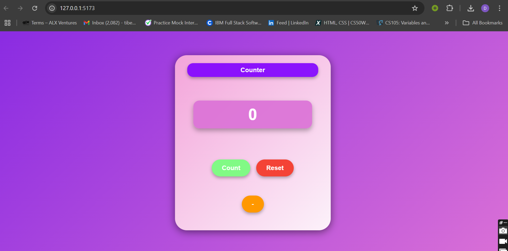

# Counter Application

## Project Overview
This project is part of the She Codes React course. The main focus of this task is to build a simple counter application.

## Getting Started

To get started with this project, follow these steps:

1. Clone the repository:
    ```bash
    git clone https://github.com/dagm24/She-Codes-React.git
    ```
2. Navigate to the project directory:
    ```bash
    cd She-Codes-React/task-2
    ```
3. Install the dependencies:
    ```bash
    npm install
    ```
4. Start the development server:
    ```bash
    npm start
    ```

## Project Structure

The project structure is as follows:

```
She-Codes-React/task-2
├── public
├── src
│   ├── App.js
│   ├── index.js
│   └── ...
├── package.json
└── README.md
```

## Features

- **Counter functionality**: Increment and decrement the counter value.
- **Reset functionality**: Reset the counter to its initial value.
- **Styling**: Basic styling to enhance the user interface.

## Screenshot

Here's a screenshot of the counter in action:

 


## Acknowledgements

- She Codes React course
